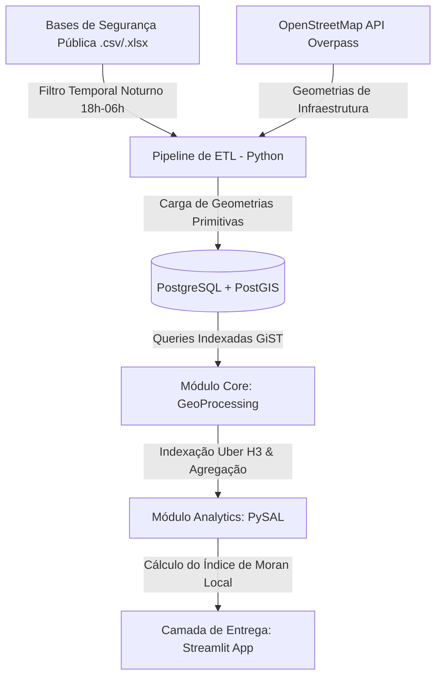

# SafeStreet: Pipeline de Inteligência Espacial e Análise de Vulnerabilidade Urbana Noturna

[](https://www.python.org/)
[](https://postgis.net/)
[](https://streamlit.io/)
[](https://h3geo.org/)
[](https://www.docker.com/)

O **SafeStreet** é uma plataforma analítica *end-to-end* que funde Engenharia de Dados Espaciais, Bancos Geográficos e Data Science para responder a um desafio crítico de segurança: **A infraestrutura urbana atua como um fator inibidor ou facilitador do crime noturno?** Unindo os registros de Secretarias de Segurança Pública à malha colaborativa do OpenStreetMap, o ecossistema isola a criminalidade sob a cobertura da noite e valida matematicamente a correlação entre a falta de iluminação pública e zonas de alto risco (hotspots).

---

## Arquitetura do Pipeline de Dados

O ecossistema foi projetado de forma modular seguindo as melhores práticas de engenharia de software e processamento distribuído de dados geográficos:



---

##  Por Que Este Projeto Existe? (O Problema de Negócio)

Mapeamentos de criminalidade convencionais limitam-se a gerar mapas de calor estáticos (*Kernel Density Estimation - KDE*) que respondem apenas *onde* o crime ocorreu. Essa abordagem ignora o ambiente urbano ao redor, impedindo ações preventivas estruturais.

O **SafeStreet** muda esse paradigma ao transformar mapas descritivos em **ferramentas prescritivas de otimização de recursos**. Em vez de distribuir postes de luz ou patrulhamento de forma homogênea e ineficiente, o algoritmo quantifica e aponta com precisão cirúrgica quais células geográficas geram o maior retorno sobre o investimento (ROI) em segurança e infraestrutura para *Smart Cities*.

---

##  Engenharia de Recursos & Detalhamento Técnico

### 1. Ingestão e Tratamento de Dados (ETL)

* **Isolamento Temporal Rígido:** Filtragem automatizada para capturar apenas delitos ocorridos no intervalo das **18h00 às 06h00**.
* **Segmentação por Natureza:** Expansão e limpeza de registros mantendo exclusivamente crimes patrimoniais de rua (roubos e furtos a pedestres), descartando ocorrências que não sofrem influência direta de variáveis físicas de visibilidade (ex: estelionato, violência doméstica).
* **Extração via Grafos do OSM:** Uso da biblioteca `OSMnx` para consultar pontos de iluminação (`highway=lighting`, `lit=yes`) mapeados, além de nós de transporte público (paradas de ônibus e metrô) como pontos de atração de fluxo de pedestres.

### 2. Armazenamento Geográfico e Performance

* **Modelagem PostGIS:** Estruturação de dados utilizando tipos geométricos nativos (`GEOMETRY(Point, 4326)`).
* **Indexação GiST (Generalized Search Tree):** Implementação de índices espaciais essenciais para otimizar operações de intersecção, buffers e junções espaciais (*Spatial Joins*), reduzindo o tempo de consulta de milhões de registros para milissegundos.

### 3. Modelagem de Discretização Espacial (Uber H3)

Para mitigar a falácia ecológica e o **Problema da Unidade de Área Modificável (MAUP)** causado por divisões políticas tradicionais (bairros), adotou-se o sistema de indexação geoespacial hexagonal **H3 da Uber** (Resolução 9, tamanho aproximado de quarteirões urbanos).

* **Agregação Uniforme:** Todas as ocorrências e pontos de infraestrutura são indexados por um ID hexadecimal único e computados de forma homogênea.

### 4. Análise Estatística Espacial (Data Science Core)

A validação científica da hipótese de dependência espacial utiliza a biblioteca `PySAL`:

* **Índice de Moran Global:** Teste estatístico para rejeitar a hipótese nula de aleatoriedade espacial ($p\text{-value} < 0.05$).
* **Índice de Moran Local (LISA):** Classificação das células hexagonais em quadrantes de associação espacial. O foco reside nas zonas **Alto-Alto** (alta densidade de crimes cercada por áreas de alta criminalidade com severo déficit de infraestrutura luminosa).

---

##  Como Executar o Projeto

### Pré-requisitos

* Docker e Docker Compose instalados.
* Python 3.9 ou superior.

```bash
# 1. Clonar o repositório e acessar a pasta
git clone https://github.com/kfrural/safestreet-pipeline.git
cd safestreet-pipeline

# 2. Instalar as dependências do ecossistema de dados Python
pip install -r requirements.txt

# 3. Inicializar o banco de dados espacial PostGIS via Docker
docker-compose up -d

# 4. Executar os pipelines de dados e a geração da malha espacial
python src/pipeline_etl.py
python src/geo_processing.py

# 5. Inicializar o dashboard analítico interactivo
streamlit run app.py

```

---

##  Estrutura de Variáveis e Métricas do Modelo

| Variável | Tipo de Dado | Fonte | Descrição |
| --- | --- | --- | --- |
| `h3_index` | `String (Hex)` | Uber H3 | Identificador geográfico único da célula hexagonal (Resolução 9). |
| `crime_count` | `Integer` | SSP / Base Pública | Volume total de crimes noturnos validados dentro do hexágono. |
| `lighting_density` | `Float` | OpenStreetMap | Quantidade de luminárias públicas ativas por metro quadrado na célula. |
| `dist_nearest_lit` | `Float (Metros)` | PostGIS Query | Distância Euclidiana da célula até o ponto de iluminação mais próximo. |
| `vulnerability_score` | `Float (0-1)` | Algoritmo Core | Índice normalizado calculando a razão entre densidade criminal e eficiência de luz. |

---

##  Contribuições

Contribuições são altamente bem-vindas! Se você deseja otimizar o algoritmo de roteamento, incluir novas camadas espaciais (ex: densidade de árvores, presença de câmeras de monitoramento) ou refatorar as queries PostGIS, sinta-se à vontade para abrir uma **Issue** ou enviar um **Pull Request**.

---
