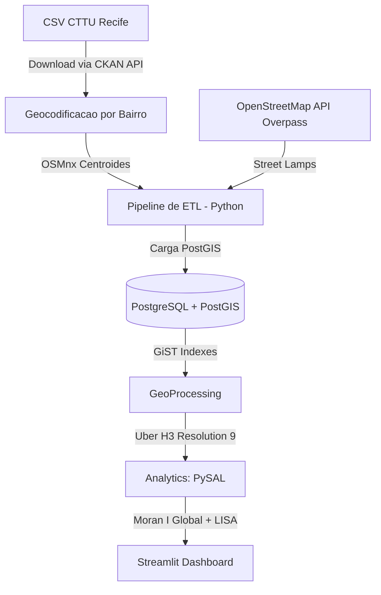

# SafeStreet: Pipeline de Inteligencia Espacial e Analise de Vulnerabilidade Urbana Noturna

[](https://www.python.org/)
[](https://postgis.net/)
[](https://streamlit.io/)
[](https://h3geo.org/)
[](https://www.docker.com/)

O **SafeStreet** e uma plataforma analitica *end-to-end* que funde Engenharia de Dados Espaciais, Bancos Geograficos e Data Science para responder a um desafio critico de seguranca: **A infraestrutura urbana atua como um fator inibidor ou facilitador da sinistralidade noturna?** Unindo registros de acidentes de transito da CTTU Recife a malha colaborativa do OpenStreetMap, o ecossistema isola a sinistralidade sob a cobertura da noite e valida matematicamente a correlacao entre a falta de iluminacao publica e zonas de alto risco (hotspots).

---

## Fonte dos Dados

| Fonte | Tipo | Granularidade | Licenca |
|-------|------|---------------|---------|
| **CTTU Recife** (dados.recife.pe.gov.br) | Acidentes de transito | Ponto (bairro + endereco) | ODbL |
| **OpenStreetMap** (Overpass API) | Iluminacao publica | Ponto (street_lamp) | ODbL |
| **OSMnx** | Geocodificacao por bairro | Centroides | MIT |

---

## Arquitetura do Pipeline de Dados



---

## Por Que Este Projeto Existe?

Mapeamentos de sinistralidade convencionais limitam-se a gerar mapas de calor estaticos (*KDE*) que respondem apenas *onde* o acidente ocorreu. Essa abordagem ignora o ambiente urbano ao redor, impedindo acoes preventivas estruturais.

O **SafeStreet** muda esse paradigma ao transformar mapas descritivos em **ferramentas prescritivas de otimizacao de recursos**. Em vez de distribuir postes de luz ou patrulhamento de forma homogenea e ineficiente, o algoritmo quantifica e aponta com precisao cirurgica quais celulas geographicas geram o maior retorno sobre o investimento (ROI) em seguranca e infraestrutura para *Smart Cities*.

---

## Engenharia de Recursos & Detalhamento Tecnico

### 1. Ingestao e Tratamento de Dados (ETL)

* **Download Automatico:** Script `scripts/download_data.py` baixa dados CTTU via CKAN API
* **Geocodificacao por Bairro:** OSMnx `geometries_from_place()` obtem centroides dos bairros de Recife
* **Isolamento Temporal Rigido:** Filtragem automatizada para capturar apenas acidentes no intervalo **18h00 as 06h00**
* **Filtro de Vitimas:** Mantem apenas acidentes com vitimas (COM VITIMA)
* **Extracao via Grafos do OSM:** `OSMnx` para pontos de iluminacao (`highway=street_lamp`)

### 2. Armazenamento Geografico e Performance

* **Modelagem PostGIS:** Tipos geometricos nativos (`GEOMETRY(Point, 4326)`)
* **Indexacao GiST:** Indices espaciais para otimizacao de intersecao, buffers e spatial joins

### 3. Modelagem de Discretizacao Espacial (Uber H3)

Para mitigar a falacia ecologica e o **MAUP** causado por divisoes politicas tradicionais (bairros), adotou-se o sistema **H3 da Uber** (Resolucao 9, tamanho aproximado de quarteiroes urbanos).

* **Agregacao Uniforme:** Todas as ocorrencias e pontos de infraestrutura sao indexados por um ID hexadecimal unico

### 4. Analise Estatistica Espacial (Data Science Core)

* **Indice de Moran Global:** Teste estatistico para rejeitar a hipotese nula de aleatoriedade espacial (p-value < 0.05)
* **Indice de Moran Local (LISA):** Classificacao das celulas hexagonais em quadrantes de associacao espacial. Foco nas zonas **Alto-Alto** (alta densidade de acidentes cercada por areas de alto risco com deficit de iluminacao)
* **Vulnerability Score:** `f(densidade_acidentes, iluminacao, distancia_luz)` normalizado entre 0 e 1

---

## Como Executar o Projeto

### Pre-requisitos

* Docker e Docker Compose instalados
* Python 3.9 ou superior

### Passo a Passo

```bash
# 1. Clonar o repositorio
git clone https://github.com/kfrural/safestreet-pipeline.git
cd safestreet-pipeline

# 2. Instalar dependencias
pip install -r requirements.txt

# 3. Baixar dados reais da CTTU (2024)
make download

# 4. Configurar variaveis de ambiente
cp .env.example .env

# 5. Subir o banco PostGIS
make db-up

# 6. Executar o pipeline ETL
make pipeline

# 7. Iniciar o dashboard
make dashboard
```

### Comandos Disponiveis (Makefile)

| Comando | Descricao |
|---------|-----------|
| `make download` | Baixa dados CTTU (ano padrao: 2024) |
| `make download YEARS="2023 2024"` | Baixa multiplos anos |
| `make pipeline` | Executa o pipeline ETL completo |
| `make dashboard` | Inicia o dashboard Streamlit |
| `make test` | Executa testes com cobertura |
| `make lint` | Verifica estilo do codigo |
| `make db-up` | Sobe o PostGIS via Docker |
| `make db-down` | Para o PostGIS |

---

## Estrutura de Variaveis e Metricas do Modelo

| Variavel | Tipo | Fonte | Descricao |
|----------|------|-------|-----------|
| `h3_index` | `String (Hex)` | Uber H3 | Identificador unico da celula hexagonal (Res. 9) |
| `crime_count` | `Integer` | CTTU | Volume total de acidentes noturnos com vitimas |
| `lighting_density` | `Float` | OpenStreetMap | Razao entre pontos de iluminacao e acidentes na celula |
| `dist_nearest_lit` | `Float (m)` | PostGIS | Distancia ate o ponto de iluminacao mais proximo |
| `vulnerability_score` | `Float (0-1)` | Algoritmo Core | Score normalizado de vulnerabilidade |
| `moran_cluster` | `String` | PySAL | Classificacao LISA (HH, LH, LL, HL, NS) |

---

## Estrutura do Projeto

```
safestreet-pipeline/
├── data/
│   ├── raw/                    # Dados brutos (CSV CTTU)
│   ├── processed/              # Resultados processados
│   └── external/               # Cache de geocodificacao
├── src/
│   ├── config.py               # Configuracao centralizada (Pydantic)
│   ├── pipeline_etl.py         # Orquestrador principal do ETL
│   ├── geo_processing.py       # Modulo de processamento geoespacial
│   ├── analytics.py            # Moran's I, LISA, pesos espaciais
│   ├── data/
│   │   ├── ingestion.py        # Carregadores CSV/Excel
│   │   ├── preprocessing.py    # Filtros temporais e de natureza
│   │   ├── osm_extractor.py    # Wrappers OSMnx
│   │   └── geocoder.py         # Geocodificacao por bairro
│   ├── db/
│   │   ├── connection.py       # SQLAlchemy engine
│   │   ├── models.py           # ORM: CrimeRecord, InfrastructurePoint, H3Cell
│   │   └── queries.py          # Inserts e queries espaciais
│   ├── spatial/
│   │   ├── h3_indexer.py       # Indexacao Uber H3
│   │   ├── postgis_ops.py      # GiST indexes, densidade, vulnerability_score, Moran
│   │   └── spatial_joins.py    # Joins espaciais por buffer
│   ├── dashboard/
│   │   ├── app.py              # Aplicacao Streamlit
│   │   └── components/
│   │       └── map_viz.py      # Mapa Folium com H3
│   └── utils/
│       ├── logger.py           # Configuracao Loguru
│       └── validators.py       # Filtros temporais e de natureza
├── scripts/
│   ├── download_data.py        # Download dados CTTU via CKAN API
│   ├── init_db.sql             # Inicializacao PostGIS
│   └── seed_db.sh              # Setup inicial do banco
├── tests/
│   ├── conftest.py             # Fixtures de teste
│   ├── test_ingestion.py       # Testes de ingestao
│   ├── test_geo_processing.py  # Testes de geoprocessamento
│   └── test_analytics.py       # Testes de analise espacial
├── docs/                       # Documentacao do projeto
├── docker-compose.yml          # Stack: PostGIS + Pipeline + Dashboard
├── Dockerfile                  # Imagem Python 3.11 + GDAL
├── Makefile                    # Comandos de conveniencia
├── pyproject.toml              # Configuracao do projeto
├── requirements.txt            # Dependencias de producao
└── requirements-dev.txt        # Dependencias de desenvolvimento
```

---

## Tecnologias Utilizadas

| Camada | Tecnologia | Justificativa |
|--------|------------|---------------|
| **Linguagem** | Python 3.11 | Ecossistema rico para data science e geoprocessamento |
| **Banco de Dados** | PostgreSQL + PostGIS 16 | Suporte nativo a operacoes espaciais |
| **Indexacao Espacial** | Uber H3 (Res. 9) | Mitigacao do MAUP, granularidade de quarteirao |
| **Analise Espacial** | PySAL (esda, libpysal) | Moran's I Global e Local (LISA) |
| **Dados Abertos** | OSMnx + Overpass API | Infraestrutura urbana do OpenStreetMap |
| **Geocodificacao** | OSMnx | Centroides de bairros de Recife |
| **Dashboard** | Streamlit + Folium | Visualizacao interativa e acessivel |
| **Containerizacao** | Docker + Docker Compose | Reprodutibilidade do ambiente |
| **Qualidade** | ruff + mypy + pytest | Linter, type checker e testes |

---

## Contribuicoes

Contribuicoes sao altamente bem-vindas! Se voce deseja otimizar o algoritmo, incluir novas camadas espaciais (ex: densidade de arvores, presenca de cameras) ou refatorar as queries PostGIS, sinta-se a vontade para abrir uma **Issue** ou enviar um **Pull Request**.

---

## Licenca

Este projeto utiliza dados abertos sob a licenca **ODbL** (Open Database License) do OpenStreetMap e da Prefeitura do Recife.
